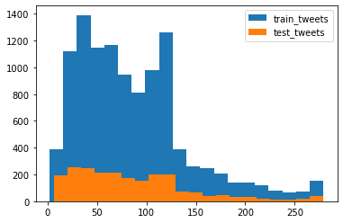
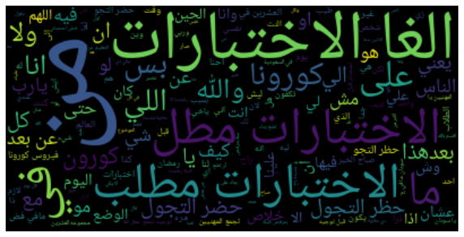
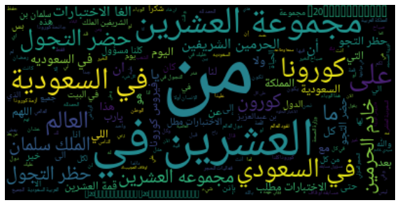

# Sentiment-Analysis-for-Arabic-Tweets

Natural Language Processing (NLP) is a hotbed of research in data science these days and one of the most common applications of NLP is sentiment analysis. From opinion polls to creating entire marketing strategies, this domain has completely reshaped the way businesses work, which is why this is an area every data scientist must be familiar with.

# Data
The data used for that project was collected from Twitter.

# Tweets length:

# WordsCloud for positive Tweets 

# WordsCloud for negative Tweets 

# Data Cleaning 

- Remove punctuation 
- Remove special characters and patterns
- Remove emojis 
# Extracting Features from Cleaned Tweets
- Bag of Words
- TF-IDF
# Word Embeddings
 1. Word2Vec
 2. Doc2Vec 
# Classification models

1. Logistic Regression
2. Support Vector Machine
3. Random Forest
4. XGBoost

# Results

# 1. Logistic Regression

| Feature         | f1 score       |
| --------------- | -------------- |
| Bag of Words    | 0.71           |  
| TF-IDF          | 0.74           |
| Word2Vec        | 0.87           |
| Doc2Vec         | 0.84           |

# 2. SVM
| Feature         | f1 score       |
| --------------- | -------------- |
| Bag of Words    | 0.715          |  
| TF-IDF          | 0.815          |
| Word2Vec        | 0.83           |
| Doc2Vec         | 0.86           |

# 3. Random Forest
| Feature         | f1 score       |
| --------------- | -------------- |
| Bag of Words    | 0.72           |  
| TF-IDF          | 0.74           |
| Word2Vec        | 0.72           |
| Doc2Vec         | 0.81           |

# 4. XGBoost
| Feature         | f1 score       |
| --------------- | -------------- |
| Bag of Words    | 0.74           |  
| TF-IDF          | 0.71           |
| Word2Vec        | 0.87           |
| Doc2Vec         | 0.79           |

